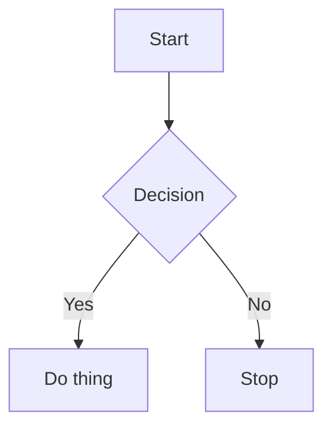

# Shortcode Embeds

Paste a link, Mermaid code, or Excalidraw JSON from your clipboard and get a Roam-friendly embed inserted into the focused block.

This extension is intentionally simple: it reads your clipboard, detects what you pasted, and replaces the focused block with the appropriate embed (or inserts child blocks for batches). After inserting, it also creates a new empty sibling block so the page remains easy to edit.

## Commands

All commands are available in the Command Palette and can be bound in Settings > Hotkeys.

- Paste Embed from clipboard (auto)
  - Detects the content type and chooses the best embed format.
- Paste Embed from clipboard (as link)
  - Forces a markdown link: `[url](url)`.
- Paste Embed from clipboard (as iframe)
  - Forces `{{iframe: url}}`.

## What gets detected

### Structured content

- Mermaid code (fenced or plain text; literal `\n` sequences are normalized)
  - Inserts a `{{mermaid}}` parent and child lines.
- Excalidraw JSON (from a .excalidraw file)
  - Inserts a `{{excalidraw}}` block with the scene data in block props.

### URLs (auto mode)

The following are recognized and converted to the preferred Roam embed where possible:

- YouTube videos and Shorts -> `{{youtube: url}}`
- YouTube playlists -> `{{iframe: https://www.youtube.com/embed/videoseries?...}}`
- Vimeo -> `{{[[video]]: url}}`
- TikTok -> `{{iframe: ...}}`
- Instagram -> `{{iframe: ...}}`
- Pinterest -> `{{iframe: ...}}`
- Wikipedia -> mobile Wikipedia iframe
- Google Docs/Sheets/Slides -> `/preview` iframe
- Google Drive file preview -> iframe
- Loom -> iframe
- SoundCloud -> oEmbed iframe (with fallback)
- Google Maps -> iframe
- Twitch clips/videos -> iframe (parent=roamresearch.com)
- CodePen, JSFiddle -> iframe
- Excalidraw links -> iframe
- Figma/FigJam -> iframe via official embed URL
- GitHub blob URLs -> rewritten to raw file URLs (so file handlers can apply)
- Medium, Substack, SlideShare -> iframe (best-effort)
- Reddit -> redditmedia embed
- Audio files -> `{{[[audio]]: url}}`
- Video files -> `{{[[video]]: url}}`
- Images -> ``
- PDF files -> `{{pdf: url}}`
- Generic oEmbed via noembed.com (late-stage fallback)
- Final fallback -> `{{iframe: url}}`

## Settings

You can configure these in the Roam Depot settings panel for the extension.

- Preserve original block text
  - When enabled, existing text in the focused block is moved into a child block before inserting the embed.
  - Default: on.
- Allow third-party oEmbed
  - When enabled, the extension may call third-party oEmbed providers (e.g. SoundCloud oEmbed and noembed.com) to resolve richer embeds.
  - Default: off.
- Allow oEmbed in batch paste
  - When enabled, batch pastes may call third-party oEmbed providers. This can be slower.
  - Default: off.

## Examples

### Mermaid (fenced)

Paste this into your clipboard, then run the auto command:



### Mermaid (plain)

```
flowchart LR
  A --> B
```

### Excalidraw

Copy the entire JSON from a `.excalidraw` file, then run the auto command.

Minimal example:

```json
{
  "type": "excalidraw",
  "version": 2,
  "source": "https://excalidraw.com",
  "elements": [],
  "appState": {"viewBackgroundColor": "#ffffff"},
  "files": {}
}
```

## Batch behavior

If the clipboard contains multiple URLs:

- The focused block is set to `Embedded Links`.
- Each URL is inserted as a child block (embed or link).
- There is a cap of 20 URLs per paste to protect performance. If more are found, the extension uses the first 20 and shows a toast.
- A new empty sibling block is created after insertion.

## Limitations and notes

- A focused block is required. The extension will warn if no block is focused.
- The focused block is preserved by default. You can disable "Preserve original block text" if you prefer the original overwrite behaviour.
- If preservation fails (for example due to a transient Roam API error), the paste is cancelled to avoid data loss.
- After insert, the extension creates a new empty sibling block to keep the page editable.
- Clipboard access depends on browser permissions.
- Some sites block iframes; those embeds may not render.
- Mermaid rendering uses Roam's bundled Mermaid (observed version 11.0.3 as of Jan 31, 2026). Newer Mermaid-only syntax may not render.
- oEmbed requests (SoundCloud/noembed) are network calls and can fail; fallbacks are used where possible.
- Google Maps short links (`maps.app.goo.gl`) may be resolved via a quick network request before embedding.
- Privacy note: third-party oEmbed is off by default. When enabled, SoundCloud and noembed.com are contacted to resolve embeds, which may expose the URL being embedded to those services.

## Suggestions / Requests

If you want a new URL type handled, open an issue or PR with:
- a sample URL
- the desired Roam shortcode (if known)
